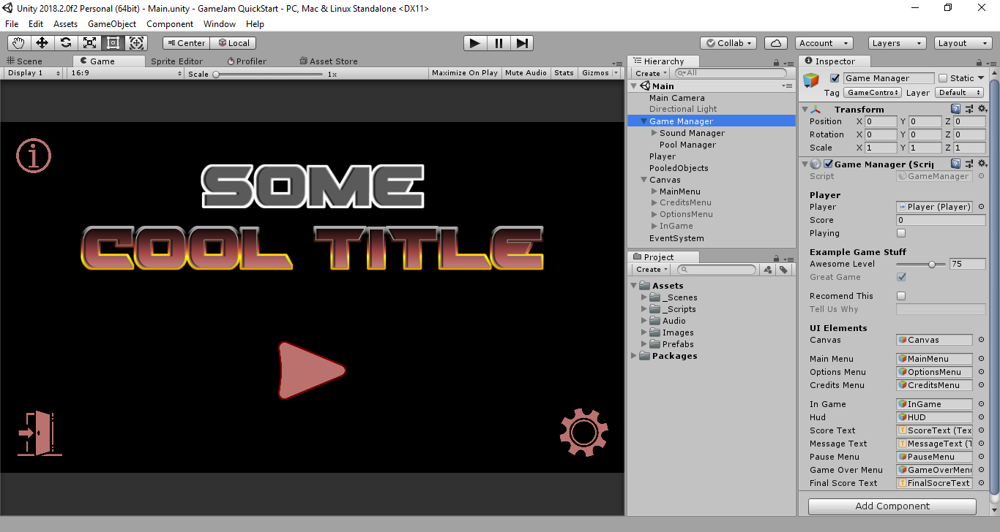

# GameJam Quickstart (for Unity)
A Unity's project setup with basic managers and stuff for a quick game developing start.



## Overview
This is a personal compilation of generic code and configurations that I personally always end up making when starting a new game project in Unity. In short terms, it's a simple base to start any game, but specially for small and Jam games, that comes with some practical and necessary features.

## Content
A ready to use Unity's project with a basic game loop functionality (no actual game included tho). It has four main "Managers" scripts to handle the game's core procedures:
* **Game Manager:** contains all other core Managers in a prefab that **must** be present in all Scenes.
* **Pool Manager:** a centerlized object pooling manager using Scriptable Objects, allowing a simple but powerful control and management of prefab clones.
* **Sound Manager:** to play sounds and music without a hassle. Simple calls like `PlayMusic()` or `PlaySfx()` will work nicely.
* **Persist Manager:** exposing methods to easily store user data on local device storage with a simple encryption to protect the data.

All these managers are made using a Singleton pattern, exposing their instances statically. So in the Game Manager you could start the music and create the object pools doing the following:

```csharp
private void Start()
{
  PersistManager.Instance.LoadSettings();
  PoolManager.Instance.CreatePools();
  SoundManager.Instance.PlayMusic();
}
```

The managers are the most interesting bit. Besides them, this project comes with other minor scripts with miscellaneous features, and example images and sounds so it looks like an actual game.